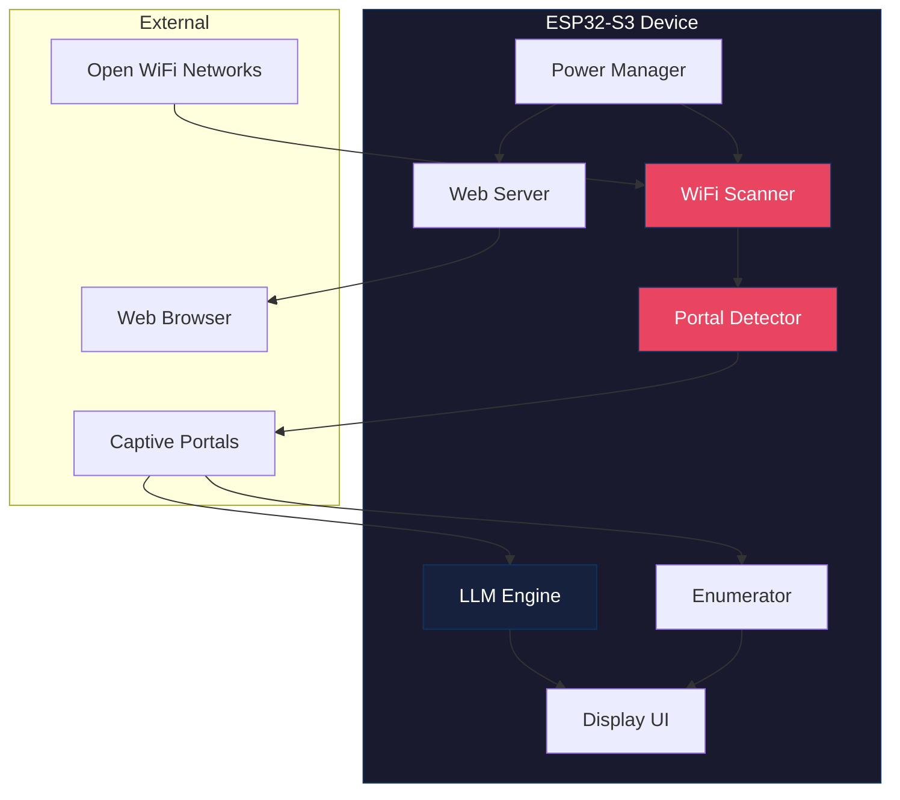
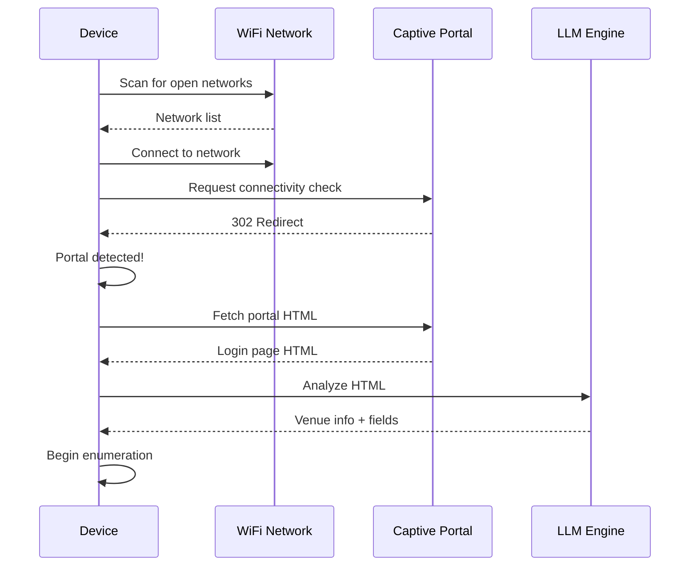
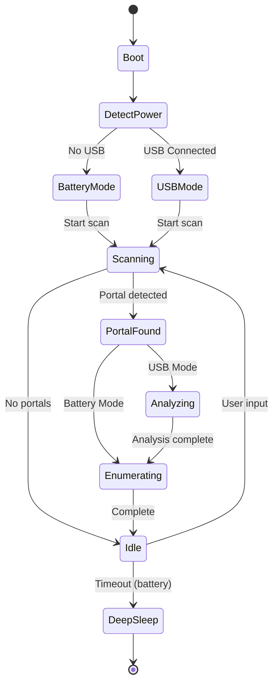

```
                ██████████
                █▓       ░██
                █▒        ██ T H E   P I N A C L E  O F  H A K C I N G   Q U A L I T Y
    █████████████░        █████████████████ ████████████ ████████████      ████████████
   ██         ███░        ███▓▒▒▒▒▒▒▒▒▒▒▒██ █▒▒▒▒▒▒▒▒▓████        █████████▓          ▒█
   ██         ███         ███▒▒▒▒▒▒▒▒▒▒▒▒▓██████████████▓        ███▓▒      ▒▓░       ▒█
   ██         ███        ░██▓▒▒▒▒▒▒▒▒▒▒▒▒▒▓██▓▒▒▒▒▒▒▒▒█▓        ███░       ░██░       ▒█
   ██         ███        ▒██▓▒▒▒▒▒▒▒▒▒▒▒▒▒▒██▓▒▒▒▒▒▒▒▓▒        ██  ▓        ██░       ▓█
   ██         ██▓        ███▒▒▒▒▒▒▒▒▒▒▒▒▒▒▒▒█▓▒▒▒▒▒▒▒▓▒       ██   █        ██░       ▓
   ██         ██▒        ██▓▒▒▒▒▒▒▒▒▒▒▒▒▒▒▒▒▓▓▒▒▒▒▒▒▒▓▒      ██    █        ▓█████████
   ██                    ██▒▒▒▒▒▒▒▒█▓▒▒▒▒▒▒▒▒▒▒▒▒▒▒▒▒▓▒   ▒███████ █░       ░▓        █
   ██         ░░         ██▒▒▒▒▒▒▒▒██▒▒▒▒▒▒▒▒▒▒▒▒▒▒▒▒▓█ ▓        ░█ ▓       ░▒       ░█
   ██         ██░       ░█▒▒▒▒▒▒▒▒▒▒▒▒▒▒▒▒▒▒▒▒▒▒▒▒▒▒▒▓█ █░        ▒ █                ░█
   ██         ██        ▓█▒▒▒▒▒▒▒▒▒██▓▒▒▒▒▒▒▒▒▒▒▒▒▒▒▒▓█ █░        ▒ █░               ▒█
    ██████████  ███████████▓██▓▓█▓█  █▓▒▒▒▒▒▒▒▒▒▓██▓██   █▓▓▓▓▓▓▓█    █▓▓▓▓▓▓▓▓▓▓▓▓▓▓██
  .:/====================█▓██▓██=========████▓█▓█ ███======> [ P R E S E N T S ] ====\:.
                           ██▓██           █▓▓▓██ ██   ┏┓┏┓┏┓┏┳┓┳┳┳┓┏┓┳┓  ┏┓┏┓┳┓┏┳┓┏┓┓
                             █▓█            ██▓██      ┃ ┣┫┃┃ ┃ ┃┃┣┫┣ ┃┃  ┃┃┃┃┣┫ ┃ ┣┫┃
                              ██              ███      ┗┛┛┗┣┛ ┻ ┗┛┛┗┗┛┻┛  ┣┛┗┛┛┗ ┻ ┛┗┗┛
```


# Captured Portal

[](https://opensource.org/licenses/MIT)
[](https://platformio.org/)
[](https://www.python.org/)
[](https://pypi.org/project/hakcer/)
[](https://www.espressif.com/en/products/socs/esp32-s3)
[](http://makeapullrequest.com)
[](USAGE_GUIDELINES.md)
[](CODE_OF_CONDUCT.md)

An ESP32-based captive portal scanner and analyzer with a hacker aesthetic. Detects captive portals, uses on-device LLM to analyze them, and extracts information about the network/venue.

---

## Legal and Ethical Use

> **This tool is intended for authorized security testing only.**

Before using this tool, you **must**:

1. Read the [Disclaimer](DISCLAIMER.md)
2. Review the [Usage Guidelines](USAGE_GUIDELINES.md)
3. Understand the [Responsible Disclosure Policy](RESPONSIBLE_DISCLOSURE.md)
4. Agree to the [Code of Conduct](CODE_OF_CONDUCT.md)

**Unauthorized access to computer systems is a crime.** The authors assume no liability for misuse.

By using this software, you accept full responsibility for ensuring your use complies with all applicable laws.

---


## Features

- **Captive Portal Detection** - Automatically scans for and identifies captive portals
- **LLM-Powered Analysis** - On-device AI analyzes portal responses to extract venue information
- **Credential Enumeration** - Tests room numbers and surnames to discover valid combinations
- **Hacker Aesthetic UI** - Matrix-style animations, decrypt effects, synthwave colors
- **Dual Interface** - Physical display + web dashboard
- **Dual Power Mode** - Battery-powered standalone OR USB-powered with boosted capabilities
- **Data Logging** - Stores all findings for later review

---

## Quick Start

### Easy Install (Recommended)

```bash
# Clone this repo
git clone https://github.com/haKC-ai/CapturedPortal.git
cd CapturedPortal

# Run the installer (creates venv, installs deps, launches build tool)
./installer.sh
```

The installer will:
- Create a Python 3.13 virtual environment
- Install all dependencies (hakcer, platformio)
- Launch the interactive build tool with menus for:
  - **Build & Flash** - Configure hardware, colors, network, then build/upload
  - **Test Portal** - Run a fake captive portal server for testing

---

## Hardware Build Guide

### Supported Boards (Available on Amazon)

| Board | Price | Display | Best For |
|-------|-------|---------|----------|
| [LILYGO T-Display S3](https://www.amazon.com/dp/B0B7X5RVTH) | ~$20 | 1.9" LCD | **Recommended** - Great balance |
| [LILYGO T-Deck](https://www.amazon.com/dp/B0C5JQKQZZ) | ~$50 | 2.8" LCD + Keyboard | **Full Featured** - Keyboard + Trackball |
| [Waveshare LCD 1.47](https://www.amazon.com/dp/B0D2X8QY7W) | ~$13 | 1.47" LCD | USB Dongle form factor |
| [ESP32-S3 Round 1.28"](https://www.amazon.com/dp/B0CSBYQXHS) | ~$15 | 1.28" Round | Compact watch-like |
| [Waveshare Touch 1.69](https://www.amazon.com/dp/B0D3GDH7VD) | ~$25 | 1.69" Touch | Touch interface |

---

### LILYGO T-Display S3 (Recommended Budget Option)

**Price:** ~$20 | **Display:** 1.9" color LCD (170x320)

| Component | Link | Price |
|-----------|------|-------|
| LILYGO T-Display-S3 | [Amazon](https://www.amazon.com/dp/B0B7X5RVTH) | ~$20 |
| 3.7V LiPo Battery (optional) | [Amazon](https://www.amazon.com/dp/B08T6GT7DV) | ~$10 |

**Specs:**
- ESP32-S3 dual-core @ 240MHz
- 16MB Flash, 8MB PSRAM
- Two programmable buttons
- Battery charging built-in
- WiFi + Bluetooth 5.0

**Assembly:** No soldering required! Just flash and go. Optional battery connects via JST connector.

---

### LILYGO T-Deck (Full Featured Option)

**Price:** ~$50 | **Display:** 2.8" LCD (320x240) + Physical Keyboard

| Component | Link | Price |
|-----------|------|-------|
| LILYGO T-Deck | [Amazon](https://www.amazon.com/dp/B0C5JQKQZZ) | ~$50 |
| LILYGO T-Deck (with LoRa) | [LILYGO Store](https://lilygo.cc/products/t-deck) | ~$60 |

**Specs:**
- ESP32-S3 dual-core @ 240MHz
- 16MB Flash, 8MB PSRAM
- **Full QWERTY keyboard** - Type room numbers, names directly
- **Trackball navigation** - Scroll through networks smoothly
- Built-in speaker and microphone
- Optional LoRa radio (433/868/915MHz)
- SD card slot for extended logging
- Battery charging built-in

**Why T-Deck?**
- Type credentials directly for manual testing
- Trackball makes navigation fast
- Larger screen shows more networks at once
- LoRa version can share findings with other devices

**Assembly:** Ready to use out of the box. Power on and the keyboard/trackball work automatically.

**Controls:**
| Input | Action |
|-------|--------|
| Trackball Up/Down | Navigate list |
| Trackball Left/Right | Switch screens |
| Trackball Click | Select / Short: action, Long: scan |
| Keyboard | Type directly into fields |

---

### Other Options

#### Waveshare ESP32-S3 LCD 1.47 (~$13)
USB dongle form factor. Plugs directly into any USB port. Great for covert use.

#### ESP32-S3 Round 1.28" (~$15)
Compact watch-like form factor. Built-in IMU. Smallest option.

#### Waveshare Touch 1.69" (~$25)
Capacitive touch screen. No buttons needed - tap to interact.

---

## Software Setup

### Prerequisites

- Python 3.13 (recommended) or 3.9+
- USB cable for your board

### Method 1: Interactive Installer (Recommended)

```bash
git clone https://github.com/haKC-ai/CapturedPortal.git
cd CapturedPortal
./installer.sh
```

The installer:
1. Creates a Python 3.13 virtual environment in `.venv/`
2. Installs dependencies from `tools/requirements.txt`
3. Launches `tools/build.py` with an interactive menu

The build tool uses the [hakcer](https://pypi.org/project/hakcer/) library for cool terminal effects and provides:
- **Menu 1: Build & Flash** - Hardware selection, color scheme, network config, build/upload
- **Menu 2: Test Portal** - Run fake captive portals for device testing

### Method 2: Manual Setup

```bash
# Clone repo
git clone https://github.com/haKC-ai/CapturedPortal.git
cd CapturedPortal

# Create venv and install deps
python3.13 -m venv .venv
source .venv/bin/activate
pip install -r tools/requirements.txt

# Build for your board
pio run -e lilygo-t-display-s3    # T-Display S3
pio run -e lilygo-t-deck          # T-Deck
pio run -e waveshare-esp32s3-lcd147  # Waveshare Dongle

# Upload firmware
pio run -t upload

# Upload web interface
pio run -t uploadfs
```

### Configuration

Edit `include/config.h` or use the build tool:

```cpp
// Color scheme
#define COLOR_SCHEME COLOR_MATRIX  // COLOR_MATRIX, COLOR_SYNTHWAVE, COLOR_CYBERPUNK, COLOR_DRACULA

// WiFi AP settings
#define AP_SSID_PREFIX "CapturedPortal_"
#define AP_PASSWORD ""  // Empty = open network

// Enable web server on battery (uses more power)
#define WEB_SERVER_ON_BATTERY false

// Scan intervals
#define BATTERY_SCAN_INTERVAL 10000  // 10s on battery
#define USB_SCAN_INTERVAL 3000       // 3s on USB
```

---

## Testing

### Test Captive Portal Server

Run a fake captive portal on your computer to test the device:

```bash
# List available portal types
python3 tools/test_portal.py --list

# Run hotel portal (default)
python3 tools/test_portal.py

# Run specific portal type
python3 tools/test_portal.py -t airport
python3 tools/test_portal.py -t cafe
python3 tools/test_portal.py -t conference
python3 tools/test_portal.py -t hospital
```

**To test:**
1. Create a WiFi hotspot on your computer
2. Run `python3 tools/test_portal.py`
3. Connect your Captured Portal device to the hotspot
4. The device will detect and analyze the test portal

**Available test portals:**
| Type | Fields | Valid Test Credentials |
|------|--------|----------------------|
| hotel | Room + Last Name | Rooms: 101, 201, 420 / Names: smith, guest |
| airport | Email | Any valid email format |
| cafe | Access Code | COFFEE2024, LATTE, 1234 |
| conference | Badge ID + Email | TC001, TC002, SPEAKER, VIP |
| hospital | Patient Room + Name | ICU1, 101, ER1 |

---

## Usage

### Power Modes

| Mode | Power Source | Capabilities |
|------|--------------|--------------|
| **Standalone** | Battery | Scanning, display UI, logging |
| **Boosted** | USB | + Web server, LLM analysis, faster scans |

Set `WEB_SERVER_ON_BATTERY true` in config to enable web server on battery (drains faster).

### Physical Controls

**T-Display S3 / Button boards:**
| Button | Short Press | Long Press |
|--------|-------------|------------|
| Left | Scroll up | Start scan |
| Right | Scroll down | Select/Connect |

**T-Deck:**
| Input | Action |
|-------|--------|
| Trackball | Navigate in all directions |
| Trackball Click | Short: Select, Long: Scan |
| Keyboard | Type directly |

### Web Interface

When web server is running:
1. Connect to WiFi: `CapturedPortal_XXXX`
2. Open: `http://192.168.4.1`
3. Features:
   - Real-time network scanner
   - Portal analysis dashboard
   - Enumeration controls
   - LLM insights
   - Activity log

---

## How It Works

### System Architecture



### Detection Flow



### Power Mode States



### Captive Portal Detection

1. Scans for open WiFi networks
2. Connects and requests `http://connectivitycheck.gstatic.com/generate_204`
3. If redirected (302) or content differs, it's a captive portal
4. Captures portal HTML for analysis

### Credential Enumeration

1. Analyzes portal form fields (room number, last name, etc.)
2. Uses wordlists (`data/wordlists/room_numbers.txt`, `data/wordlists/surnames.txt`)
3. Tests combinations based on detected field types
4. Logs successful combinations
5. Estimates venue size from valid room numbers

### LLM Analysis (USB Mode)

1. Feeds captured HTML to on-device LLM
2. Extracts: venue name, type, form fields, security issues
3. Provides enumeration strategy recommendations

---

## Project Structure

```
CapturedPortal/
├── installer.sh              # Main installer script
├── banner                    # ASCII art banner
├── platformio.ini            # Build configuration
├── DISCLAIMER.md             # Legal disclaimer
├── USAGE_GUIDELINES.md       # Acceptable use policy
├── RESPONSIBLE_DISCLOSURE.md # Vulnerability disclosure policy
├── CODE_OF_CONDUCT.md        # Community standards
├── src/
│   ├── main.cpp              # Entry point
│   ├── core/
│   │   ├── scanner.cpp       # WiFi scanning & portal detection
│   │   ├── enumerator.cpp    # Credential enumeration
│   │   └── power.cpp         # Power management
│   ├── display/
│   │   ├── ui.cpp            # Display UI
│   │   └── effects.cpp       # Hacker animations
│   ├── web/
│   │   └── server.cpp        # Web server & API
│   └── llm/
│       └── engine.cpp        # LLM inference
├── include/
│   └── config.h              # Configuration
├── data/
│   ├── web/                  # Web UI files
│   └── wordlists/            # Enumeration wordlists
└── tools/
    ├── requirements.txt      # Python dependencies (hakcer, platformio, pyserial)
    ├── build.py              # Build & test menu tool
    └── test_portal.py        # Test captive portal server
```

---

## License

MIT License - hack responsibly.

---

## Credits

- Inspired by the [hakcer](https://pypi.org/project/hakcer/) Python library aesthetic
- LLM engine based on [esp32-llm](https://github.com/DaveBben/esp32-llm)
- Built with love for the hacker community
